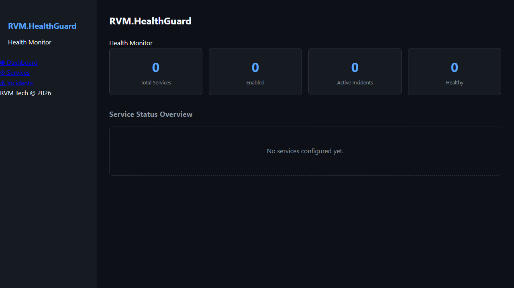
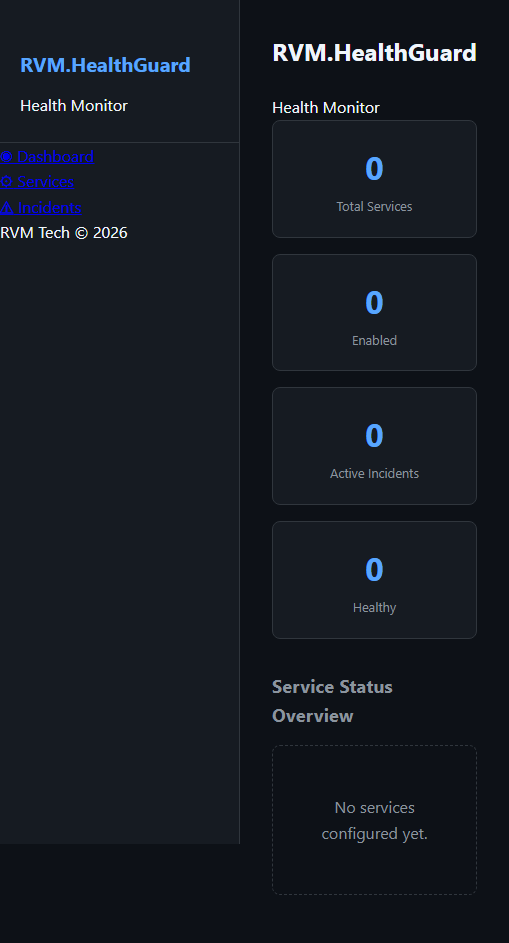
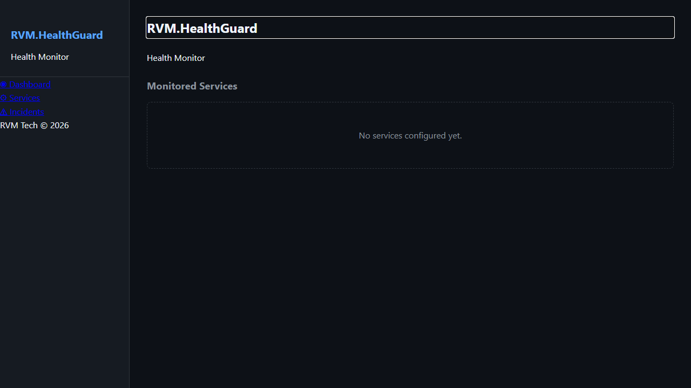
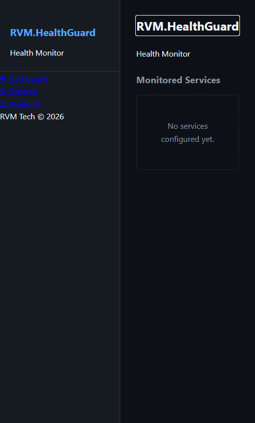
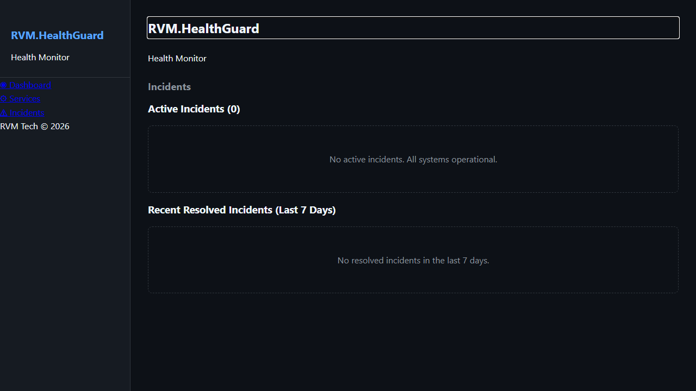
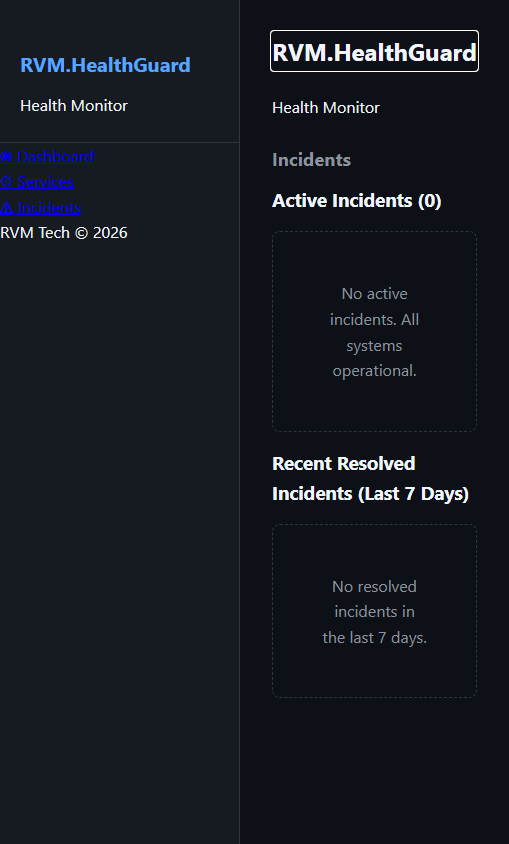

# RVM.HealthGuard - Manual do Usuario

> Monitoramento HTTP em Tempo Real — Guia Completo de Funcionalidades
>
> Gerado em 26/04/2026 | RVM Tech

---

## Visao Geral

O **RVM.HealthGuard** monitora endpoints HTTP em tempo real, detecta incidentes e notifica a equipe.

**Recursos principais:**
- **Monitoramento HTTP** — verificacao periodica de endpoints (30s a 24h)
- **Alertas em tempo real** — notificacoes via e-mail, webhook e Slack
- **Incidentes automaticos** — criados e fechados sem intervencao manual
- **Uptime e SLA** — relatorios para periodos de 7, 30, 60 e 90 dias
- **Dashboard SignalR** — atualizacoes em tempo real sem reload

---

## 1. Dashboard de Monitoramento

Visao geral em tempo real do estado de todos os servicos monitorados. Exibe status atual, tempo de resposta e disponibilidade geral do sistema.

**Funcionalidades:**
- Status global: ONLINE / DEGRADADO / OFFLINE
- Tempo de resposta medio de todos os servicos
- Uptime percentual geral (ultimos 30 dias)
- Contagem de incidentes abertos
- Atualizacao automatica via SignalR (sem reload de pagina)
- Historico de status em grafico de barras (ultimas 24h)

| Desktop | Mobile |
|---------|--------|
|  |  |

---

## 2. Servicos Monitorados

Lista completa de endpoints HTTP monitorados. Para cada servico, exibe status atual, tempo de resposta, frequencia de verificacao e uptime historico.

**Funcionalidades:**
- Listagem de todos os endpoints monitorados
- Status individual: UP / DOWN / DEGRADED
- Tempo de resposta atual e media dos ultimos 7 dias
- Uptime percentual por servico
- Intervalo de verificacao configuravel (30s a 24h)
- Adicionar, editar e remover servicos
- Tags para agrupamento por ambiente ou time

> **Dicas:**
> - Use intervalos de 1 minuto para servicos criticos e 5 minutos para os demais.
> - Tags como "producao" e "staging" facilitam o filtro no dashboard.

| Desktop | Mobile |
|---------|--------|
|  |  |

---

## 3. Incidentes

Registro cronologico de todos os incidentes detectados. Um incidente e criado automaticamente quando um servico fica indisponivel e fechado quando ele volta ao normal.

**Funcionalidades:**
- Lista de incidentes abertos e fechados
- Duracao, servico afetado e causa raiz
- Timeline de eventos dentro do incidente
- Notificacoes enviadas durante o incidente
- Comentarios e notas de pos-mortem
- Exportacao de relatorio por periodo

> **Dicas:**
> - Use as notas de pos-mortem para registrar causa raiz e acoes corretivas.

| Desktop | Mobile |
|---------|--------|
|  |  |

---

## 4. Relatorio de Uptime

Historico detalhado de disponibilidade por servico. Permite visualizar uptime por periodo: 7, 30, 60 e 90 dias.

**Funcionalidades:**
- Uptime percentual por servico e por periodo
- Grafico de disponibilidade diaria (barras coloridas)
- Tempo total de downtime no periodo
- SLA calculado automaticamente
- Exportacao CSV para relatorios

| Desktop | Mobile |
|---------|--------|
|  |  |

---

## 5. Configuracao de Alertas

Gerenciamento de canais de notificacao e regras de alerta. Suporta notificacoes via e-mail, webhook e Slack quando um servico muda de estado.

**Funcionalidades:**
- Canais suportados: E-mail, Webhook HTTP, Slack
- Regras por servico ou por grupo de servicos
- Condicoes: DOWN, DEGRADED, RECOVERED
- Cooldown de alertas para evitar spam
- Teste de canal antes de salvar
- Historico de notificacoes enviadas

> **Dicas:**
> - Configure o cooldown para pelo menos 5 minutos em servicos com oscilacoes frequentes.
> - Use o botao "Testar" para confirmar que o canal esta funcionando antes de ativar.

| Desktop | Mobile |
|---------|--------|
|  |  |

---

## Informacoes Tecnicas

| Item | Detalhe |
|------|---------|
| **Tecnologia** | ASP.NET Core + Blazor Server |
| **Tempo real** | SignalR (WebSocket) |
| **Banco de dados** | PostgreSQL 16 |
| **Notificacoes** | E-mail, Webhook HTTP, Slack |

---

*Documento gerado automaticamente com Playwright + TypeScript — RVM Tech*
